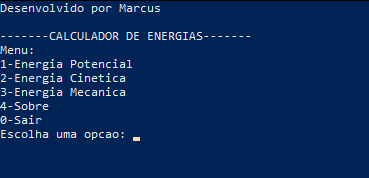

# Calculador de Fórmulas de Energia

Este é um programa feito em C++ que calcula três das principais fórmulas de energia na física mecânica.  
São elas:
- Energia Potencial
- Energia Cinética
- Energia Mecânica

O mesmo possui um menu interativo de opções no console e realiza os cálculos em uma classe separada,  
com métodos tanto para as fórmulas, quanto para a entrada de dados.

As fórmulas usadas são as seguintes:  
Energia Potencial:  
$`Ep = m.g.h`$  

Energia Cinética:  
$`Ec = \frac{m.v^2}{2}`$  

Energia Mecânica:  
$`Em = Ep + Ec`$

## Compilação
Nota: É necessário ter o compilador do C/C++.

Use:  
g++ main.cpp -o calculador  
./calculador  

**Esse programa foi feito apenas como aprendizado dos conteúdos de física e programação.**